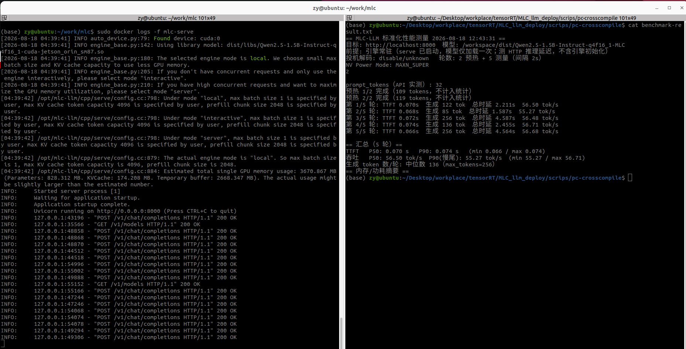
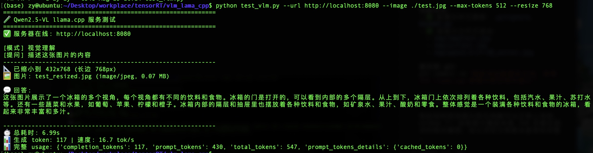

# Jetson 边缘 AI 部署实战

在 NVIDIA Jetson Orin 上构建高性能边缘 AI 应用，涵盖 **计算机视觉** 和 **大语言模型** 两大领域。本项目提供从 **模型优化 → 自动化部署 → 性能调优 → 服务集成** 的完整技术方案，通过 **TensorRT** 和 **MLC-LLM** 两大技术路线配合 **一键部署脚本**，在 8GB 内存约束下实现从 **0.5B 到 3B** 参数模型的高效推理，实测性能达 **60 tok/s**，相比 ONNX Runtime 提升 **7-30 倍**。

## 🎯 核心价值

- **🚀 性能突破**：通过 TensorRT 优化实现 7-30 倍推理加速，通过 MLC-LLM 编译器路线突破 8GB 内存限制
- **🤖 一键部署**：提供完整的自动化部署脚本，从环境检查到性能测试全程自动化，降低部署门槛
- **🔧 技术对比**：提供运行时优化（TensorRT-Edge-LLM）与编译时优化（MLC-LLM）两大技术路线的实测对比
- **📊 完整方案**：覆盖从环境搭建、模型转换、引擎构建到 HTTP 服务部署的全流程
- **🌐 生产就绪**：Docker 容器化部署，OpenAI API 兼容接口，支持快速集成到实际应用
- **👁️ 多模态支持**：基于 llama.cpp 部署完整的视觉语言模型，支持图像理解、OCR 和多模态对话



---

## 🚀 核心成果与部署能力

### 👁️ 视觉语言模型：Qwen2.5-VL-3B 多模态理解

| 能力类型       | 推理性能     | 内存占用 | 模型大小 | 应用场景                |
| -------------- | ------------ | -------- | -------- | ----------------------- |
| **纯文本生成** | 19.4 tok/s   | ~3GB     | 1.8 GB   | 对话、知识问答          |
| **图像理解**   | 16.7 tok/s   | ~4.5 GB  | 2.8 GB   | 场景描述、物体识别      |
| **OCR 识别**   | 15-20 tok/s  | ~4 GB    | 2.8 GB   | 文字提取、表格识别      |
| **多模态对话** | 10-15 tok/s  | ~5 GB    | 2.8 GB   | 图文交互、复杂推理      |

> 基于 llama.cpp 在 Jetson 8GB 上部署完整多模态模型，**支持图像理解、OCR 和多模态对话**，适用于边缘智能应用。

### 🖼️ 计算机视觉：ResNet18 图像分类

| 推理方式                | 平均延迟 | 吞吐量  | vs ONNX Runtime  | 模型大小 |
| ----------------------- | -------- | ------- | ---------------- | -------- |
| ONNX Runtime            | 39.6 ms  | 25 QPS  | 1.0x（基准）     | 92 MB    |
| **TensorRT FP32** | 5.4 ms   | 187 QPS | **7.4x**   | 45 MB    |
| **TensorRT FP16** | 2.7 ms   | 374 QPS | **15x** ⭐ | 23 MB    |
| **TensorRT INT8** | 1.3 ms   | 748 QPS | **30x**    | 12 MB    |

**生产环境推荐 FP16**，边缘极限场景用 INT8。

### 🤖 大语言模型：多技术路线部署

#### TensorRT-Edge-LLM 路线：Qwen2.5-0.5B 对话推理

| 推理方式               | 模型大小 | 内存占用 | 推理能力             | 部署方式            |
| ---------------------- | -------- | -------- | -------------------- | ------------------- |
| **Qwen2.5-0.5B** | 943 MB   | ~2-3 GB  | 中英文对话、代码生成 | TensorRT + HTTP API |
| TensorRT-Edge-LLM      | 优化引擎 | 高效推理 | 支持 Plugin 模式     | 一键部署脚本        |

> 成功在 Jetson 8GB 内存设备上部署 0.5B 参数模型，通过 **完整的自动化部署套件** 实现从环境检查到性能测试的全程自动化部署。

#### MLC-LLM 路线：Qwen2.5-1.5B/3B 编译器优化

| 模型           | 生成速度    | TTFT   | 峰值内存 | 智能能力 | 适用场景           |
| -------------- | ----------- | ------ | -------- | -------- | ------------------ |
| **1.5B** | 60 tok/s    | 0.077s | 4.44GB   | 中等     | 日常对话、实时响应 |
| **3B**   | 25-35 tok/s | ~0.15s | ~5.5GB   | 更强     | 复杂推理、专业任务 |

> 基于 MLC-LLM v0.20.0 编译器路线，PC 交叉编译 + Jetson 运行，突破 8GB 内存限制，支持更大参数模型。

#### llama.cpp 路线：Qwen2.5-VL-3B 多模态视觉理解

| 模型               | 模型大小 | 内存占用 | 推理能力                   | 部署方式               |
| ------------------ | -------- | -------- | -------------------------- | ---------------------- |
| **Qwen2.5-VL-3B** | ~2.8 GB  | ~4.5 GB  | 图像理解、OCR、多模态对话 | llama.cpp + HTTP API  |
| Q4_K_M 量化        | 1.8 GB   | -        | 平衡精度与速度             | GPU 加速推理          |

> 基于 llama.cpp 在 Jetson 8GB 上部署完整多模态模型，支持图像理解和文字识别，**纯文本生成 19.4 tok/s，图像理解 16.7 tok/s**。


---

## 🛠️ 环境信息

| 项目               | 版本                                              |
| ------------------ | ------------------------------------------------- |
| 设备               | NVIDIA Jetson Orin（ARM64）                       |
| 系统               | Ubuntu 22.04 + JetPack 6.x（L4T 36.5）            |
| CUDA               | 12.6                                              |
| TensorRT           | 10.3.0                                            |
| PyTorch            | 2.x（jetson-containers 镜像内置）                 |
| TensorRT-Edge-LLM  | 0.6.0                                             |
| MLC-LLM            | 0.20.0                                            |
| llama.cpp          | 最新稳定版                                        |
| 部署方式           | Docker 容器（基于 `dustynv/jetson-containers`） |

---

## 📁 项目结构

```
tensorRT/
├── 🖼️ 计算机视觉部署（ResNet18）
│   ├── imageNet_deploy/
│   │   ├── onnx_test.ipynb              # 主测试：多精度性能对比
│   │   ├── video_speed_test.ipynb       # 视频推理速度对比
│   │   └── README.md                    # ImageNet 部署详细说明
│   ├── src/                             # 源代码（按功能模块化）
│   │   ├── inference/                   #   TensorRT 推理实现
│   │   ├── calibration/                 #   INT8 校准脚本
│   │   ├── export/                      #   模型导出（PyTorch→ONNX）
│   │   ├── test/                        #   测试与验证脚本
│   │   └── utils/                       #   辅助工具
│   └── resnet18.onnx                    # ONNX 模型（已提交）
│
├── 🤖 大语言模型部署（多技术路线）
│   │
│   ├── 🔹 TensorRT-Edge-LLM 路线（0.5B）
│   │   ├── qwen25_0.5b_trt/
│   │   │   ├── engine_new/              # TensorRT 引擎目录
│   │   │   │   ├── llm.engine           # 主引擎文件（1.5GB）
│   │   │   │   ├── config.json          # 模型配置
│   │   │   │   └── tokenizer.json       # 分词器
│   │   │   ├── Qwen2.5-0.5B-Instruct/   # 原始模型文件
│   │   │   ├── performance_test.py      # 性能测试脚本
│   │   │   ├── run_perf_test.sh         # 快捷测试脚本
│   │   │   └── PERF_TEST_README.md      # 性能测试说明
│   │   │
│   │   └── Edge_llm_deploy/
│   │       ├── README.md                # 详细部署说明文档
│   │       ├── requirements.txt         # Python 依赖管理
│   │       ├── llm_server.py            # OpenAI 兼容 HTTP 服务器
│   │       ├── llm_client.py            # 客户端示例
│   │       └── scripts/                 # 自动化部署脚本
│   │           ├── deploy.sh            # 主部署脚本（多子命令）
│   │           ├── build_engine.sh      # TensorRT 引擎构建脚本
│   │           ├── benchmark.sh         # 性能测试脚本
│   │           └── test_client.py       # 增强客户端测试工具
│   │
│   ├── 🔹 MLC-LLM 路线（1.5B/3B）
│   │   └── MLC_llm_deploy/
│   │       ├── README.md                # MLC 部署套件说明
│   │       ├── scripts/                 # 自动化部署脚本
│   │       │   ├── jetson-run.sh         # Jetson 快速启动脚本
│   │       │   ├── benchmark.sh          # 性能基线采集
│   │       │   └── example-3b.sh         # 3B 模型部署示例
│   │       ├── integration/              # 系统集成
│   │       │   ├── llm_gateway.py        # FastAPI 网关
│   │       │   └── ros2/                 # ROS2 节点集成
│   │       └── DOC/                      # 技术文档
│   │           ├── MLC-LLM-Qwen2.5-1.5B-3B-Jetson实验报告.md
│   │           ├── Jetson Orin 8GB 部署 Qwen2.5 1.5B_3B：MLC-LLM 实操文档.md
│   │           └── Qwen2.5-3B部署指南.md
│   │
│   └── 🔹 llama.cpp 路线（多模态 3B）
│       └── vlm_lama_cpp/
│           ├── README.md                # VLM 部署完整指南
│           ├── test_vlm.py              # 多模态综合测试脚本
│           ├── test_ocr.py              # OCR 专项测试脚本
│           ├── DOC/                     # 技术文档
│           │   ├── qwen2.5-vl-3B_deploy_log.md          # 部署日志
│           │   └── qwen2.5-vl-3b_llama_experiment_report.md  # 实验报告
│           └── *.jpg                    # 测试图片文件
│
├── 📚 完整文档
│   └── DOC/
│       ├── TECH_BLOG_Jetson_TensorRT_Complete_Guide.md    # ResNet 技术博客（完整版）
│       ├── TECH_BLOG_CONCISE.md                                # ResNet 技术博客（精简版）
│       ├── PERFORMANCE_REPORT.md                               # 性能测试报告
│       ├── TensorRT_镜像环境配置完整报告.md                      # Docker 镜像配置
│       ├── TensorRT-Edge-LLM 经典应用全流程实施报告_v0.6.0.md   # LLM 部署报告
│       ├── TensorRT-Edge-LLM_C++ 编程指南.md                    # LLM C++开发指南
│       └── TensorRT-Edge-LLM 经济级应用算子实施报告.md           # LLM Plugin说明
│
└── 🔧 第三方框架
    ├── TensorRT-Edge-LLM/         # NVIDIA LLM 推理框架（.gitignore 排除）
    └── MLC相关依赖               # MLC-LLM 编译器和权重（.gitignore 排除）
```

> 详细说明见各子目录的 README.md

---

## ⚡ 快速开始

### 🖼️ 场景一：ResNet18 图像分类

#### 1. 启动 Docker 容器

```bash
docker run -d --name jupyter-tensorrt --runtime=nvidia \
    -v "$(pwd)":/workspace -w /workspace -p 8889:8888 \
    jupyter-tensorrt:complete
```

#### 2. 模型导出（PyTorch → ONNX）

```bash
python src/export/export_resnet.py      # 输出 resnet18.onnx
```

#### 3. 生成 TensorRT 引擎

```bash
# FP32 / FP16 / INT8
trtexec --onnx=resnet18.onnx --saveEngine=resnet18.engine
trtexec --onnx=resnet18.onnx --saveEngine=resnet18_fp16.engine --fp16
trtexec --onnx=resnet18.onnx --saveEngine=resnet18_int8.engine --int8
```

#### 4. 执行推理

```python
from src.inference.tensorrt_inference_fixed import TensorRTInference
import numpy as np

inferencer = TensorRTInference("resnet18_fp16.engine")
result = inferencer.infer(np.random.randn(1, 3, 224, 224).astype(np.float32))
print(result.shape)   # (1, 1000)
```

---

### 🤖 场景二：Qwen2.5-0.5B 对话推理（TensorRT-Edge-LLM）

#### 1. 自动化部署（推荐）

```bash
cd Edge_llm_deploy

# 环境检查
./scripts/deploy.sh check

# 一键完整部署（从零到可用）
./scripts/deploy.sh all

# 启动服务
./scripts/deploy.sh start-server
```

#### 2. 手动部署（详细步骤）

如需手动部署或了解详细流程，请查看 `Edge_llm_deploy/README.md`：

```bash
# 分步部署
./scripts/deploy.sh install-python   # 安装 Python 工具链
./scripts/deploy.sh install-cpp      # 编译 C++ Runtime
./scripts/deploy.sh export-onnx      # 导出 ONNX 模型
./scripts/deploy.sh build-engine     # 构建 TensorRT 引擎
./scripts/deploy.sh start-server     # 启动 HTTP 服务
```

#### 3. 验证部署

```bash
# 测试服务
./scripts/deploy.sh test

# 性能测试
./scripts/deploy.sh benchmark

# 交互式对话
./scripts/test_client.py --mode interactive
```

#### 4. 客户端调用（兼容 OpenAI API）

```python
from openai import OpenAI

client = OpenAI(
    base_url="http://<jetson-ip>:8000/v1",
    api_key="not-needed"
)

response = client.chat.completions.create(
    model="qwen2.5-0.5b",
    messages=[{"role": "user", "content": "你好，请介绍一下自己"}]
)
print(response.choices[0].message.content)
```

```

---

### 🚀 场景三：Qwen2.5-1.5B/3B 对话推理（MLC-LLM）

#### 1. 快速启动（1.5B 模型）

```bash
cd MLC_llm_deploy

# 拷贝 scripts/ 到 Jetson 后
./jetson-run.sh check      # 环境检查
./jetson-run.sh swap-on    # 挂 8G swap（防首次 JIT OOM）
./jetson-run.sh download   # 下载 1.5B 权重（~840MB）
./jetson-run.sh serve      # 启动服务（:8000）
```

#### 2. 验证推理

```bash
curl -N http://localhost:8000/v1/chat/completions \
  -H "Content-Type: application/json" \
  -d '{"model":"Qwen2.5-1.5B-Instruct-q4f16_1-MLC","messages":[{"role":"user","content":"你好"}],"stream":true,"max_tokens":64}'
```

#### 3. 采集性能基线

```bash
./benchmark.sh    # 1.5B 模型基线测试
```

#### 4. 启动 3B 模型（更强智能）

```bash
# 设置环境变量切换到 3B（压上下文到 2048 适配 8GB）
MODEL_SIZE=3B MAX_SEQ_LEN=2048 ./jetson-run.sh download   # 下载 3B 权重（~1.9GB）
MODEL_SIZE=3B MAX_SEQ_LEN=2048 ./jetson-run.sh serve      # 启动 3B 服务

# 采 3B 基线
MODEL_SIZE=3B ./benchmark.sh
```

#### 5. 系统集成（可选）

```bash
# 启动 FastAPI 网关（支持 1.5B/3B 切换）
pip install fastapi uvicorn httpx
uvicorn integration.llm_gateway:app --host 0.0.0.0 --port 8080

# ROS2 节点集成
ros2 run <pkg> mlc_llm_client_node --ros-args -p gateway_url:=http://localhost:8080
```

---

### 👁️ 场景四：Qwen2.5-VL-3B 多模态视觉理解（llama.cpp）

#### 1. 编译 llama.cpp

```bash
# 安装依赖
sudo apt update && sudo apt install -y build-essential cmake git curl

# 克隆并编译（启用 CUDA）
git clone https://github.com/ggml-org/llama.cpp.git
cd llama.cpp
cmake -B build -DGGML_CUDA=ON
cmake --build build --config Release -j $(nproc)
```

#### 2. 下载模型

```bash
# 下载主模型
huggingface-cli download Taoufik/Qwen2.5-VL-3B-Instruct-Q4_K_M-GGUF \
  --local-dir ./qwen_vl_gguf/

# 下载视觉投影组件
wget https://huggingface.co/Mungert/Qwen2.5-VL-3B-Instruct-GGUF/resolve/main/Qwen2.5-VL-3B-Instruct-mmproj-f16.gguf \
  -P ./qwen_vl_gguf/
```

#### 3. 启动多模态服务

```bash
cd llama.cpp

# 启动服务器（包含视觉功能）
./build/bin/llama-server \
  -m ./qwen_vl_gguf/qwen2.5-vl-3b-instruct-q4_k_m.gguf \
  --mmproj ./qwen_vl_gguf/Qwen2.5-VL-3B-Instruct-mmproj-f16.gguf \
  --ctx-size 3072 \
  -ngl 99 \
  --host 127.0.0.1 \
  --port 8080
```


#### 4. 测试视觉理解

```bash
cd ../vlm_lama_cpp

# 图像理解测试
python test_vlm.py --image ./test.jpg --prompt "描述这张图片的内容"

# 自动缩放图片（避免超上下文）
python test_vlm.py --image ./large.jpg --resize 768

# OCR 文字识别
python test_ocr.py --image ./document.jpg --type document

```


#### 5. API 调用示例

```bash
# 纯文本对话
curl http://localhost:8080/v1/chat/completions \
  -H "Content-Type: application/json" \
  -d '{
    "messages": [{"role": "user", "content": "你好"}],
    "max_tokens": 256
  }'

# 图像理解（base64 编码）
IMG_BASE64=$(base64 -w 0 image.jpg)
curl http://localhost:8080/v1/chat/completions \
  -H "Content-Type: application/json" \
  -d '{
    "messages": [{
      "role": "user",
      "content": [
        {"type": "image_url", "image_url": {"url": "data:image/jpeg;base64,'"$IMG_BASE64"'"}},
        {"type": "text", "text": "描述这张图片"}
      ]
    }]
  }'
```

---

## 📚 文档导航

### 计算机视觉（ResNet18）

| 文档                                                                 | 说明                                                   |
| -------------------------------------------------------------------- | ------------------------------------------------------ |
| 📖[技术博客（完整版）](DOC/TECH_BLOG_Jetson_TensorRT_Complete_Guide.md) | 环境搭建 → 模型转换 → 引擎生成 → 推理 → 部署全流程 |
| 📄[技术博客（精简版）](DOC/TECH_BLOG_CONCISE.md)                        | 核心要点与性能数据，5 分钟速读                         |
| 📊[性能测试报告](DOC/PERFORMANCE_REPORT.md)                             | 多精度详细测试数据与分析                               |
| 🐳[镜像环境配置报告](DOC/TensorRT_镜像环境配置完整报告.md)              | Docker 镜像构建与故障排除                              |

### 大语言模型（TensorRT-Edge-LLM）

| 文档                                                                                              | 说明                             |
| ------------------------------------------------------------------------------------------------- | -------------------------------- |
| 📘[TensorRT-Edge-LLM 经典应用全流程实施报告](DOC/TensorRT-Edge-LLM_经典应用全流程实施报告_v0.6.0.md) | LLM 框架部署、引擎构建、推理优化 |
| 🔧[TensorRT-Edge-LLM C++ 编程指南](DOC/TensorRT-Edge-LLM_C++_编程指南.md)                            | C++ API 使用与自定义开发         |
| ⚡[TensorRT-Edge-LLM Plugin 实施报告](DOC/TensorRT-Edge-LLM_经济级应用算子实施报告.md)               | Attention Plugin 与算子优化      |
| 🌐[Edge_llm_deploy 说明](Edge_llm_deploy/README.md)                                                  | HTTP 服务部署与 OpenAI API 对接  |
| 📊[性能测试说明](qwen25_0.5b_trt/PERF_TEST_README.md)                                                | 自动化性能测试与指标采集         |

### 大语言模型（MLC-LLM）

| 文档                                                                                                        | 说明                                    |
| ----------------------------------------------------------------------------------------------------------- | --------------------------------------- |
| 🚀[MLC-LLM 实验报告](MLC_llm_deploy/DOC/MLC-LLM-Qwen2.5-1.5B-3B-Jetson实验报告.md)                             | 8GB 设备部署 1.5B/3B 模型实验数据与分析 |
| 📖[MLC-LLM 实操文档](MLC_llm_deploy/DOC/Jetson%20Orin%208GB%20部署%20Qwen2.5%201.5B_3B：MLC-LLM%20实操文档.md) | 编译器路线完整部署指南                  |
| 🔧[Qwen2.5-3B 部署指南](MLC_llm_deploy/DOC/Qwen2.5-3B部署指南.md)                                              | 3B 模型特定配置说明                     |
| 🌐[MLC_llm_deploy 说明](MLC_llm_deploy/README.md)                                                              | 部署套件使用说明与系统集成              |

### 视觉语言模型（llama.cpp）

| 文档                                                                         | 说明                               |
| ---------------------------------------------------------------------------- | ---------------------------------- |
| 📖[VLM 部署指南](vlm_lama_cpp/README.md)                                      | llama.cpp 部署 Qwen2.5-VL 完整指南 |
| 🔬[VLM 实验报告](vlm_lama_cpp/DOC/qwen2.5-vl-3b_llama_experiment_report.md)  | 多模态模型部署实验数据分析         |
| 📋[VLM 部署日志](vlm_lama_cpp/DOC/qwen2.5-vl-3B_deploy_log.md)               | 详细部署过程记录                   |

---

## 🔑 关键技术点

### 计算机视觉优化

- **Docker 容器化**：基于 `jetson-containers`，环境可重复、易部署
- **TensorRT 优化**：图融合、内核自动调优、Tensor Core 加速
- **多精度推理**：FP32/FP16/INT8，按场景选择
- **TensorRT 10.3 API 兼容**：使用 `num_io_tensors` / `get_tensor_name` / `execute_v2` 新 API

### 大语言模型部署（TensorRT-Edge-LLM）

- **TensorRT-Edge-LLM 框架**：专门为边缘设备优化的 LLM 推理
- **Attention Plugin 优化**：融合注意力计算，提升推理效率
- **内存管理**：8GB 设备成功部署 0.5B 参数模型
- **OpenAI API 兼容**：标准 HTTP 接口，易于集成
- **多指标性能监控**：内存、功耗、温度、利用率全面采集

### 大语言模型部署（MLC-LLM）

- **编译器路线**：基于 TVM 的编译优化，生成 Jetson 专属 CUDA 库
- **交叉编译部署**：PC 编译 + Jetson 运行，绕过 8GB 构建期限制
- **q4f16_1 量化**：保持推理精度的同时显著降低内存占用
- **多模型支持**：1.5B（60 tok/s）和 3B（25-35 tok/s）按需选择
- **系统集成**：FastAPI 网关 + ROS2 节点，支持机器人应用

### 视觉语言模型部署（llama.cpp）

- **多模态支持**：基于 llama.cpp 的完整 VLM 部署，支持图像理解和文字识别
- **双组件架构**：主模型 + mmproj 视觉投影，支持复杂视觉任务
- **GPU 加速**：CUDA 后端优化，纯文本 19.4 tok/s，图像理解 16.7 tok/s
- **灵活配置**：支持图片缩放、上下文调整，适应不同应用需求
- **OpenAI 兼容**：标准 HTTP API，易于集成到现有系统

---

## 🎯 部署建议

### 技术路线选择

| 需求场景              | 推荐方案                   | 理由                                     |
| --------------------- | -------------------------- | ---------------------------------------- |
| 实时响应（<100ms）    | TensorRT-Edge-LLM 0.5B      | 轻量级，低延迟，API 兼容，自动化部署     |
| 高质量对话            | MLC-LLM 1.5B               | 智能更强，60 tok/s 速度优秀              |
| 复杂推理任务          | MLC-LLM 3B                 | 最佳智能表现，25-35 tok/s 可接受         |
| 图像识别              | TensorRT ResNet18 FP16     | 15x 加速，生产环境推荐                   |
| 快速集成              | TensorRT-Edge-LLM 0.5B      | OpenAI 兼容，一键部署脚本                |
| **视觉-语言多模态**   | **llama.cpp VLM 3B**        | **图像理解、OCR、多模态对话，边缘完整支持** |
| **文字识别与理解**    | **llama.cpp VLM 3B**        | **专用 OCR 能力，表格和文档理解优秀**    |

### 设备选择指南

| 设备内存   | 推荐模型                        | 用途场景                    |
| ---------- | ------------------------------- | --------------------------- |
| 4GB        | ResNet18 FP16/INT8             | 图像分类、目标检测           |
| 8GB        | Qwen2.5-0.5B + ResNet18        | 对话推理 + 计算机视觉        |
| 8GB (优化) | Qwen2.5-1.5B (MLC)             | 高质量对话 + 实时响应        |
| 8GB (极限) | Qwen2.5-3B (MLC)               | 复杂推理 + 专业任务          |
| 8GB (多模) | **Qwen2.5-VL-3B (llama.cpp)** | **视觉理解 + OCR + 多模态对话** |
| 16GB+      | 多模型组合                      | 复杂多模态应用               |

### 精度选择建议

- **ResNet18**：生产环境推荐 **FP16**（15x 加速，23MB 模型）
- **Qwen2.5-0.5B**：适合 **8GB 设备**，API 服务首选
- **Qwen2.5-1.5B**：MLC 路线推荐，**性能与资源最佳平衡**
- **Qwen2.5-3B**：复杂推理任务，需要参数调优（`MAX_SEQ_LEN=2048`）
- **Qwen2.5-VL-3B**：多模态视觉理解，**Q4_K_M 量化**，支持图像和文字处理

---

**测试设备**：NVIDIA Jetson Orin ｜ **TensorRT**：10.3.0 ｜ **TensorRT-Edge-LLM**：0.6.0 ｜ **MLC-LLM**：0.20.0 ｜ **llama.cpp**：最新版 ｜ **更新日期**：2024-08-23
